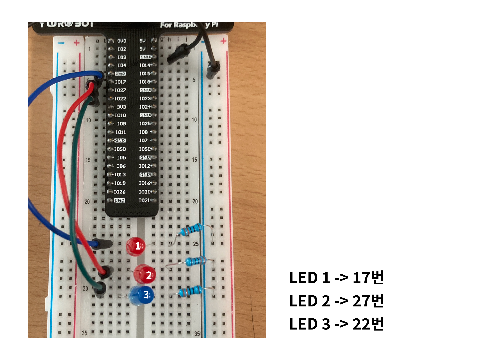

# Raspberry Pi 3비트 이진수 LED 카운터

이 프로젝트는 Raspberry Pi의 GPIO 핀을 사용해 3개의 LED를 제어하고,  
**0부터 7까지 이진수로 표현된 값을 시각적으로 표시**하는 실습입니다.

---

## 🖼 회로 이미지



위 사진은 실제 구성된 회로입니다.  
3개의 LED가 브레드보드에 배치되어 있으며, 각각 GPIO 17번, 27번, 22번에 연결되어 있습니다.

- GPIO 17번 → 가장 왼쪽 LED 
- GPIO 27번 → 가운데 LED
- GPIO 22번 → 가장 오른쪽 LED 

각 LED는 저항을 거쳐 GND에 연결되어 있습니다.

---

## 🔧 사용 부품 및 연결 정보

### 사용 부품
- Raspberry Pi (GPIO 확장보드 사용 가능)
- 브레드보드
- LED 3개
- 저항 3개 (330Ω)
- 점퍼 케이블

### GPIO 핀 연결

| LED 위치   | 연결된 GPIO | 역할 |
|------------|--------------|------|
| 왼쪽 (MSB) | GPIO 17번     | 2진수 상위 비트 |
| 가운데     | GPIO 27번     | 2진수 중간 비트 |
| 오른쪽 (LSB)| GPIO 22번    | 2진수 하위 비트 |

> 모든 LED는 **GPIO → 저항 → GND** 순서로 연결되어야 합니다.

---

## 💡 이진수 LED 카운터 스크립트

이 Bash 스크립트는 0부터 7까지의 값을 1초 간격으로 증가시키면서,  
해당 값을 **3비트 이진수로 변환하여 LED에 출력**합니다.

```bash
#!/bin/bash

# GPIO 핀 (왼쪽부터 오른쪽 순서로, MSB부터 LSB)
LEDS=(17 27 22)
CHIP=gpiochip0

# 무한 반복
while true; do
    # 0부터 7까지 카운트
    for i in {0..7}; do
        # i를 3비트 이진수 문자열로 변환
        bin=$(printf "%03d" "$(echo "obase=2;$i" | bc)")

        # LED 설정
        for j in {0..2}; do
            bit=${bin:$j:1}
            gpioset $CHIP ${LEDS[$j]}=$bit
        done

        sleep 1
    done
done
```

---

### 🧾 코드 설명

| 코드 라인 | 설명 |
|-----------|------|
| `#!/bin/bash` | Bash 스크립트 선언 |
| `LEDS=(17 27 22)` | MSB부터 LSB까지 LED가 연결된 GPIO 핀 배열 |
| `CHIP=gpiochip0` | GPIO 칩 이름 (기본값 사용) |
| `while true; do ... done` | 무한 루프를 통해 LED 상태 지속적으로 갱신 |
| `for i in {0..7}` | 0부터 7까지 정수를 반복 |
| `bin=$(...)` | 현재 정수를 3자리 이진수 문자열로 변환 |
| `for j in {0..2}` | 이진수 각 자릿수에 대해 반복 |
| `bit=${bin:$j:1}` | 해당 자릿수 비트값 추출 |
| `gpioset $CHIP ${LEDS[$j]}=$bit` | 해당 GPIO 핀에 0 또는 1 출력 (LED 점등/소등) |
| `sleep 1` | LED 상태 1초간 유지 |


