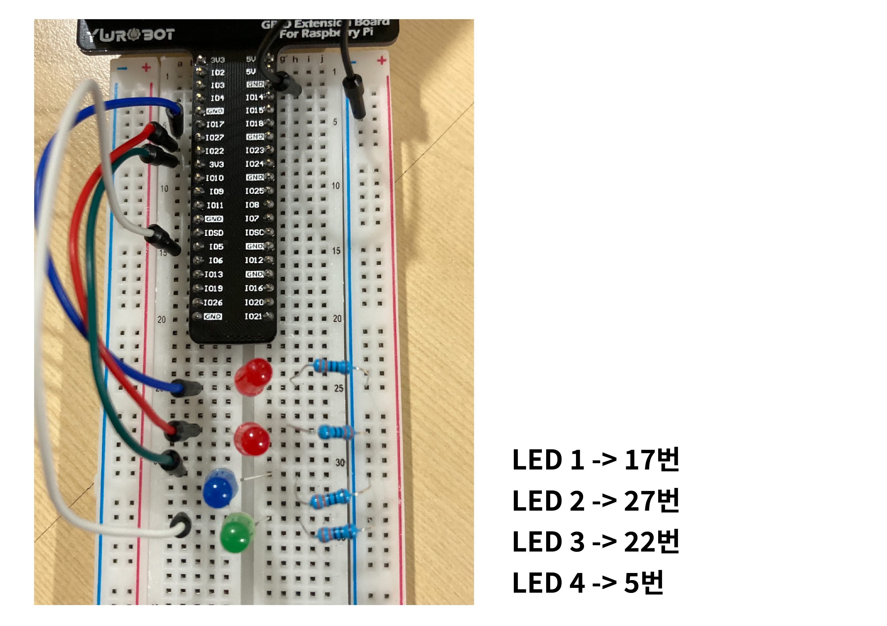
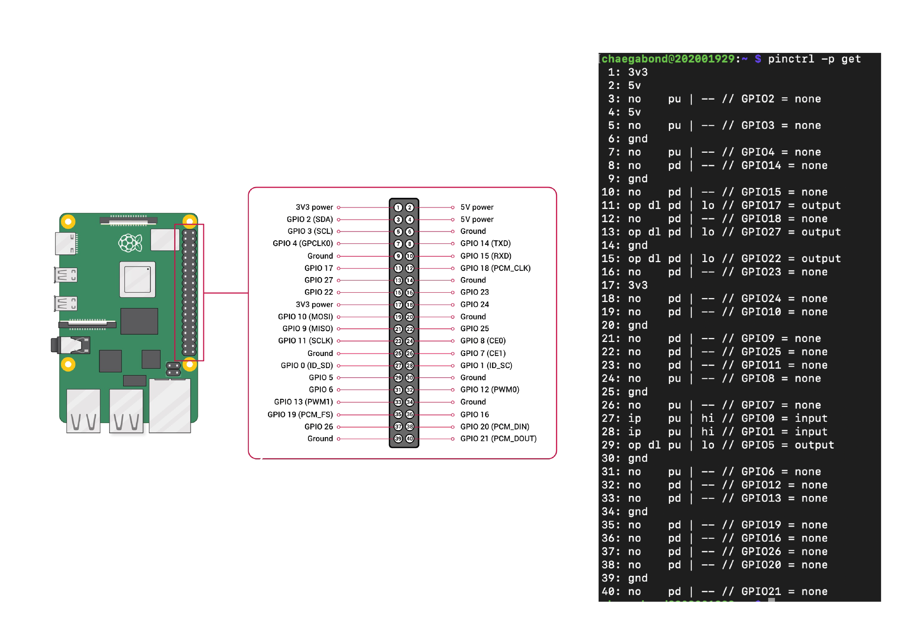

# Raspberry Pi GPIO를 활용한 LED 순차 제어 프로젝트

이 프로젝트는 Raspberry Pi의 GPIO 핀을 이용해 4개의 LED를 순차적으로 제어하는 실습입니다.  
간단한 회로 구성과 Bash 스크립트를 통해 GPIO 제어 원리를 익힐 수 있습니다.


유튜브 시연 영상: https://youtu.be/x0e2hnGxXF0

---

## 🖼 회로 이미지



위 이미지는 실제 구성된 LED 회로입니다. 각 LED는 브레드보드에 배치되어 있으며, Raspberry Pi의 GPIO 핀에 연결되어 있습니다.

---

## 🔧 회로 구성 및 부품

### 사용 부품 목록
- Raspberry Pi (GPIO 확장보드 사용)
- 브레드보드
- LED 4개 (빨강 ×2, 파랑, 초록)
- 저항 4개 (330Ω)
- 점퍼 케이블

### 연결 핀 정보

| LED 색상   | GPIO 번호 |
|------------|------------|
| 빨간 LED 1 | GPIO 17    |
| 빨간 LED 2 | GPIO 27    | 
| 파란 LED   | GPIO 22    | 
| 초록 LED   | GPIO 5     | 

> 각 LED의 양극은 해당 GPIO 핀에 연결되고, 음극은 저항을 통해 GND에 연결됩니다.

---

## 🔎 GPIO 핀 상태 확인

아래 명령어를 통해 현재 GPIO 핀의 상태를 확인할 수 있습니다:

```bash
pinctrl -p get
```

### 출력 예시



출력에서 다음과 같은 정보가 보이면 LED가 해당 핀에 연결되어 있고, 출력 상태임을 나타냅니다:

```
GPIO17 = output, lo
GPIO27 = output, lo
GPIO22 = output, lo
GPIO5  = output, lo
```

- `output`: 출력 모드로 설정된 상태
- `lo`: 현재 출력이 LOW (LED 꺼짐)
- 나중에 `hi`로 전환되면 LED가 켜지게 됩니다.

---

## 💡 LED 순차 점등 스크립트 (Bash)

아래는 4개의 GPIO 핀에 연결된 LED를 순차적으로 1초 간격으로 켜고 끄는 Bash 스크립트입니다.

### 🔽 코드

```bash
#!/bin/bash

# 사용할 GPIO 핀들 (순서대로 점등)
PINS=(17 27 22 5)
CHIP=gpiochip0

# 모든 핀을 초기화 (OFF)
for PIN in "${PINS[@]}"; do
    gpioset $CHIP $PIN=0
done

# 무한 반복
while true; do
    for PIN in "${PINS[@]}"; do
        # 모든 핀 OFF 후 하나만 ON
        for ALLPIN in "${PINS[@]}"; do
            gpioset $CHIP $ALLPIN=0
        done
        gpioset $CHIP $PIN=1
        sleep 1
        gpioset $CHIP $PIN=0
    done
done

```

---

### 🧾 코드 설명

| 코드 라인 | 설명 |
|-----------|------|
| `#!/bin/bash` | Bash 스크립트를 나타내는 shebang |
| `PINS=(17 27 22 5)` | 점등할 GPIO 핀들을 배열로 정의 |
| `CHIP=gpiochip0` | 사용할 GPIO 컨트롤러 이름 지정 |
| `for PIN in ...` | 시작 전에 모든 핀을 OFF 상태로 초기화 |
| `while true; do ... done` | 무한 반복 루프로 점등 동작 실행 |
| `for PIN in ...` | 핀을 순차적으로 선택하여 점등 |
| `for ALLPIN in ...` | 루프마다 모든 핀을 먼저 OFF |
| `gpioset $CHIP $PIN=1` | 현재 선택된 핀을 ON (LED 켜기) |
| `sleep 1` | LED 점등 상태를 1초 유지 |
| `gpioset $CHIP $PIN=0` | LED를 끔 |


